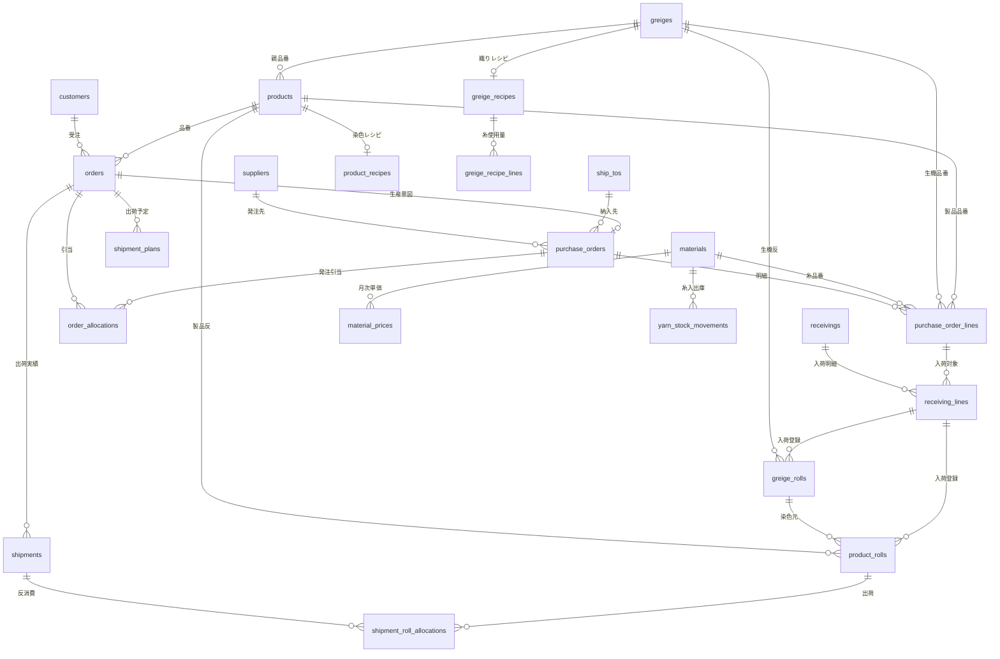

# 全体DB設計案（DBplan）

このファイルは、このアプリを最終的にDB化するときの**設計の地図**です。  
マイグレーションの実装手順は `memo/DB.md`、壁打ち用の学習メモもそちらを参照してください。

**このドキュメントの目的**

- テーブル一覧を俯瞰できる
- 各テーブルについて「なぜあるのか」を4行で説明できる
- `DemoData.php` や JSON ファイルを、どのテーブルに置き換えるかがわかる

**実装はまだしない。** 設計のたたき台として使う。

---

## 設計の前提（共通ルール）

| 項目     | 方針                                                                                 |
| ------ | ---------------------------------------------------------------------------------- |
| 主キー    | すべて `id`（自動採番）                                                                     |
| 人間向け番号 | `code` 列（`SO-2606-001` など）で **unique**                                             |
| 糸の量    | **kg**（`decimal`）                                                                  |
| 金額     | **整数（円）**                                                                          |
| 名前の参照  | 得意先名など文字列ではなく **ID（外部キー）** でつなぐ                                                    |
| 製品在庫数  | `products` に `stock` は持たない。`product_rolls`（在庫あり）の `tan_qty` / `actual_qty_m` 合計で算出 |
| 生機在庫数  | `greiges` に `stock` は持たない。`greige_rolls`（在庫あり）の合計で算出                               |
| 発注3種別  | **親** `purchase_orders` **+ 明細** `purchase_order_lines`（1対多）。種別は親の `type` で区別し、品目・数量は明細行に持つ             |

### 繊維業務の数量ルール（確定事項）

現場の運用に合わせて、**取引（受注・発注）** と **在庫（入荷後の物理反）** でルールを分ける。

| 区分          | 反数の扱い                                 | メートル（m）の扱い                          |
| ----------- | ------------------------------------- | ----------------------------------- |
| **受注**      | 基本は整数反。稀に m 指定                        | m 受注は `order_qty_mode = meters`     |
| **発注**      | 整数反のみ                                 | 見積換算用。`meters_per_tan` は標準長         |
| **入荷（在庫化）** | **0.25反刻み**あり（工場ミスで短くなった反）            | **反ごとに実測m**を入力（織り場・染工場）             |
| **生機在庫**    | 反ごとに長さが異なる。染色時に**半分カット**して使う（部分消費OK）  | 実測mを `greige_rolls` に保持             |
| **製品在庫**    | 反ごとに長さが異なる。**出荷時に反を切らない**（在庫単位を丸ごと出す） | 実測mを `product_rolls` に保持。請求・納品は実測m  |
| **引当（未入荷）** | 整数反 or 標準換算                           | 実測がわからない間は `meters_per_tan` で見積してよい |

**マスタの** `meters_per_tan` … 見積・画面換算・引当用の**標準長**（実測ではない）。

**受注の完了判定**

- `order_qty_mode = tan` … 出荷した反数合計 ≥ 受注反数
- `order_qty_mode = meters` … 出荷した**実測m**合計 ≥ 受注m

**在庫テーブルを生機と製品で分ける理由**

- 触る現場が違う（織り場＝生機、染工場・倉庫＝製品）
- 消費ルールが違う（生機＝半分カット可、製品＝丸ごと出荷のみ）
- 在庫一覧をシンプルに保てる

**既存** `inbound_lots` **について**

- 現状は「m のかたまり・部分消費」前提 → **業務と合わない**
- 移行先は `product_rolls`（1行＝1物理反）。既存テーブルは段階的に置き換え

---

## テーブル一覧（ステータス付き）

| 区分  | テーブル名                            | 状態          | 置き換え元                                     |
| --- | -------------------------------- | ----------- | ----------------------------------------- |
| マスタ | `customers`                      | 新規          | `DemoData::customers()`                   |
| マスタ | `suppliers`                      | 新規          | `DemoData::suppliers()`                   |
| マスタ | `ship_tos`                       | 新規          | `DemoData::shipTos()`                     |
| マスタ | `greiges`                        | 新規          | `DemoData::greiges()`                     |
| マスタ | `products`                       | **既存・拡張**   | `DemoData::products()`                    |
| マスタ | `materials`                      | **既存・拡張**   | `DemoData::materials()`                   |
| 取引  | `orders`                         | 新規          | `DemoData::orders()`                      |
| 取引  | `purchase_orders`                | 新規          | `DemoData::purchaseOrders()`（共通ヘッダ）       |
| 取引  | `purchase_order_lines`           | 新規          | 旧 種別子3テーブルを統合（糸・生機・製品の明細）              |
| 取引  | `order_allocations`              | 新規          | `StockAllocation` JSON                    |
| 取引  | `receivings`                     | 新規          | `DemoData::receivings()`                  |
| 取引  | `receiving_lines`                | 新規          | 入荷と発注明細行の紐づけ                               |
| 取引  | `shipments`                      | 新規          | `DemoData::shipments()`                   |
| 在庫  | `greige_rolls`                   | 新規          | `FabricTanRoll`（生機段階）                     |
| 在庫  | `product_rolls`                  | 新規          | `FabricTanRoll`（製品段階）/ `inbound_lots` 移行先 |
| 在庫  | `inbound_lots`                   | **既存・廃止予定** | → `product_rolls` へ移行                     |
| 在庫  | `shipment_plans`                 | **既存・FK追加** | `ShipmentPlan` JSON / DB                  |
| 在庫  | `shipment_roll_allocations`      | 新規（名称変更）    | `shipment_lot_consumptions` 移行先           |
| 在庫  | `shipment_lot_consumptions`      | **既存・廃止予定** | → `shipment_roll_allocations` へ移行         |
| 在庫  | `yarn_stock_movements`           | 新規          | `DemoData::yarnStockBase()` 等             |
| 原価  | `product_recipes`                | 新規          | `DemoData::recipeData()`                  |
| 原価  | `greige_recipes`                 | 新規          | `DemoData::greigeRecipeData()`            |
| 原価  | `greige_recipe_lines`            | 新規          | 生機レシピの糸明細                                 |
| 原価  | `material_prices`                | 新規          | `DemoData::materialPrices()`              |
| 予測  | `forecast_manual_adjustments`    | **既存**      | 月末在庫の手動調整                                 |
| 予測  | `month_end_forecasts`            | **既存**      | 月末在庫予測ヘッダ                                 |
| 予測  | `month_end_forecast_lines`       | **既存**      | 月末在庫予測明細                                  |
| 予測  | `sales_forecasts`                | 新規          | `SalesForecastSnapshot` JSON              |
| 予測  | `sales_forecast_lines`           | 新規          | `SalesForecastLine` JSON                  |
| 認証  | `users`                          | **既存**      | Laravel 標準                                |

※ `cache` / `jobs` はフレームワーク用のため本設計の対象外。

---

## 全体のつながり（ER図）

---

## 各テーブルの4行メモ

書き方の意味：

- **何のため？** … このテーブルがないと何ができないか
- **1行は何？** … 1レコードが現場の何1件に対応するか
- **なぜ分けた？** … 別テーブルにした理由（または既存のままの理由）
- **つながり** … 主な外部キー

---

### マスタ

#### `customers`（得意先）【新規】

- **何のため？** お客さん（得意先）の基本情報を1か所で管理する
- **1行は何？** 1社の得意先（例：東レ商事）
- **なぜ分けた？** 受注のたびに会社名を文字列で書くと表記ゆれや変更時の修正が大変だから。受注には `customer_id` だけ持たせる
- **つながり** → `orders.customer_id`

主要列：`name`, `contact`, `tel`, `note`, `deleted_at`（任意）

---

#### `suppliers`（仕入先）【新規】

- **何のため？** 糸・織・染などの発注先を管理する
- **1行は何？** 1社の仕入先（例：中央染色加工）
- **なぜ分けた？** 発注種別（糸/生機/製品）ごとに選べる仕入先が決まっている。種別は `type` で絞り込む
- **つながり** → `purchase_orders.supplier_id`

主要列：`name`, `contact`, `tel`, `type`（spinning/weaving/dyeing 等）

---

#### `ship_tos`（納入先・工場・倉庫）【新規】

- **何のため？** 発注したものの「どこに届けるか」を管理する
- **1行は何？** 1か所の納入先（例：中央染工場、本社倉庫）
- **なぜ分けた？** 仕入先（誰から買うか）と納入先（どこに届けるか）は別の概念だから
- **つながり** → `purchase_orders.ship_to_id`

主要列：`name`, `type`（weaving/dyeing/warehouse）

---

#### `greiges`（生機マスタ）【新規】

- **何のため？** 織る前の生地（生機）の品番を管理する
- **1行は何？** 1種類の生機品番（例：KB-A 生機A）
- **なぜ分けた？** 1つの生機から複数カラーの製品がぶら下がる（親子関係）。製品とは別マスタにする
- **つながり** → `products.greige_id`、生機発注（`purchase_order_lines`）・生機レシピ・`greige_rolls`

主要列：`sku`(unique), `name`, `category`, `unit`, `meters_per_tan`（標準長・見積用）

---

#### `products`（製品マスタ）【既存・拡張】

- **何のため？** 販売・在庫・受注の単位となる製品品番を管理する
- **1行は何？** 1種類の製品（例：FAB-A-BK）
- **なぜ分けた？** 品番・価格・カラーなど変わりにくい情報はマスタに集約。日々増える受注・入荷とは分ける
- **つながり** ← `greiges`、→ `orders`, `purchase_order_lines`, `product_rolls`, `product_recipes`

既存列：`name`, `sku`, `price`, `category`, `unit`  
追加案：`greige_id`, `color`, `meters_per_tan`（標準長・見積用）, `stock_min_m`  
※ `stock` 列は持たない（在庫は `product_rolls` 合計）

---

#### `materials`（原材料マスタ）【既存・拡張】

- **何のため？** 糸・染料などの原材料を管理する
- **1行は何？** 1種類の原材料（例：綿糸 RM-001）
- **なぜ分けた？** 糸単価・生機レシピ・糸発注で同じ原材料を参照する。名前の重複を防ぐ
- **つながり** → `material_prices`, `greige_recipe_lines`, `purchase_order_lines`, 糸在庫

既存列：`name`, `unit`  
追加案：`sku`(unique), `type`（yarn/dye/finishing）

---

### 取引（受注・発注）

#### `orders`（受注）【新規】

- **何のため？** お客さんからの注文を記録し、納期・出荷残を追う
- **1行は何？** 1件の受注（今のアプリは 1受注 = 1製品）
- **なぜ分けた？** 得意先・製品はマスタ。受注は日々増える「取引」だから別テーブル
- **つながり** ← `customers`, `products`、→ `purchase_orders`, `order_allocations`, `shipment_plans`, `shipments`

主要列：`code`(unique), `customer_id`, `product_id`, `order_qty_mode`（`tan` / `meters`）, `qty_tan`（整数）, `qty_meters`, `meters_overridden`, `shipped_qty_tan`, `shipped_qty_m`（実測合計）, `order_date`, `due_date`, `planned_ship_date`, `ship_memo`

完了判定：`order_qty_mode` に応じて反数 or 実測m で残量ゼロを判定。

---

#### `purchase_orders`（発注・共通ヘッダ）【新規】

- **何のため？** 糸・生機・製品の発注を、一覧・入荷・引当で共通に参照できるヘッダとして記録する
- **1行は何？** 1件の発注（種別は `type` で区別：yarn / greige / product）
- **なぜ分けた？** 発注は受注とは別の業務フロー。仕入先・納入先・納期など共通情報はヘッダに、品目・数量は明細行へ分離する
- **つながり** ← `suppliers`, `ship_tos`, `orders`（生産意図）、→ `purchase_order_lines`, `greige_rolls`, `product_rolls`, `order_allocations`

主要列：`code`(unique), `type`, `status`, `supplier_id`, `ship_to_id`, `order_id`, `order_date`, `due_date`, `arrival_memo`

**制約（実装時）**：親の `type` に応じて明細行の品目 FK が1つだけ NOT NULL。1発注に複数明細行可（同一種別のみ。糸・生機・製品の混在はしない）。  
**重要：**`order_id` **は「生産意図」。数量の引当は** `order_allocations` **で別管理。**

**一覧画面の取り方**：`purchase_orders` と `purchase_order_lines` を JOIN する。

---

#### `purchase_order_lines`（発注明細）【新規】

- **何のため？** 糸・生機・製品それぞれの品目・数量・入荷済み量・工程を1テーブルで保持する
- **1行は何？** 1発注の1明細行（品番1つ分）
- **なぜ分けた？** 旧設計の種別子3テーブル（1対1）を統合し、複数明細行と入荷の紐づけ（`receiving_lines`）に対応するため
- **つながり** ← `purchase_orders`, `materials` / `greiges` / `products`（種別に応じて1つ）、→ `receiving_lines`

主要列：`purchase_order_id`, `line_no`, `material_id`, `greige_id`, `product_id`, `qty_kg`, `received_qty_kg`, `qty_tan`（整数）, `meters_per_tan`, `qty_meters`, `received_qty_tan`, `received_qty_m`, `stage`, `finish_date`, `contact_date`

**廃止:** `yarn_purchase_orders`, `greige_purchase_orders`, `product_purchase_orders`（2026-07 に `purchase_order_lines` へ統合済み）

---

#### `order_allocations`（受注への引当）【新規】

- **何のため？** 在庫または発注予定を、どの受注に何反／何m充てるか記録する
- **1行は何？** 1受注への1つの引当（在庫引当 or 発注引当）
- **なぜ分けた？** `purchase_orders.order_id`（意図）と、実際の数量引当（`StockAllocation` JSON）は別概念。複数行・部分引当に対応するため
- **つながり** ← `orders`, `products`, `purchase_orders`（nullable）

主要列：`order_id`, `product_id`, `purchase_order_id`, `allocation_type`（stock/po）, `qty_tan`, `qty_m`（未入荷時は標準 `meters_per_tan` で見積可）

---

#### `receivings`（入荷ヘッダ）【新規】

- **何のため？** 「いつ入荷したか」の入荷イベントを記録する
- **1行は何？** 1回の入荷処理（例：RC-2606-001）
- **なぜ分けた？** 発注（予定）と入荷（実績）は別タイミングで起きる。1発注に複数回入荷もありうる
- **つながり** → `receiving_lines`

主要列：`code`(unique), `received_date`, `note`

仕入先・品目は `receiving_lines` → `purchase_order_lines` → `purchase_orders` 経由で辿る。ヘッダに `purchase_order_id` / `supplier_id` は持たない。

---

#### `receiving_lines`（入荷明細）【新規】

- **何のため？** 入荷イベントと発注明細行を紐づける（どの発注明細に対する入荷か）
- **1行は何？** 1入荷の1発注明細行分
- **なぜ分けた？** 在庫の正は `greige_rolls` / `product_rolls` / `yarn_stock_movements`。`qty_*` は一覧用キャッシュ（`ReceivingLineTotals::sync`）
- **つながり** ← `receivings`, `purchase_order_lines`、→ `greige_rolls`, `product_rolls`

主要列：`receiving_id`, `purchase_order_line_id`, `line_no`, `qty_tan`, `qty_m`, `qty_kg`（表示用キャッシュ）

種別は紐づく `purchase_order_lines` と親 `purchase_orders.type` から導出。1入荷に複数行可（同一種別のみ）。糸＋製品の混在はしない。

**将来:** `receiving_roll_amendments`（反明細修正履歴・段階6c）、複数明細行 UI（段階6d）

---

#### `shipments`（出荷実績）【新規】

- **何のため？** 実際に出荷した記録（売上・在庫減の根拠）を残す。請求・納品は実測m
- **1行は何？** 1回の出荷（例：SH-2606-001）
- **なぜ分けた？** 受注（注文）と出荷（実績）は別。分納で1受注に複数出荷がつく
- **つながり** ← `orders`, `products`、→ `shipment_roll_allocations`

主要列：`code`(unique), `order_id`, `product_id`, `qty_tan`（出荷反数合計）, `qty_m`（実測m合計）, `shipped_date`, `ship_to_name`, `note`

---

### 在庫・反明細

#### `greige_rolls`（生機の物理反）【新規】

- **何のため？** 織り上がり生機を反ごとの実測mで在庫管理する。染色時の半分カット（部分消費）に対応する
- **1行は何？** 1つの生機在庫単位（通常1反。工場ミスで短い場合は0.25反刻み）
- **なぜ分けた？** 製品在庫と消費ルールが違う（生機は染色で半分使用）。織り場が反ごとに実測入力するから
- **つながり** ← `greiges`, `purchase_orders`, `receiving_lines`、→ `product_rolls`（`parent_greige_roll_id`）

主要列：`code`(unique), `greige_id`, `purchase_order_id`, `receiving_line_id`, `tan_qty`（0.25刻み）, `actual_qty_m`（織り実測）, `status`（in_stock / partially_consumed / consumed）, `received_date`  
部分消費時：行を分割するか `tan_qty` を減らして残りを新行にする（実装時に決定）。

---

#### `product_rolls`（製品の物理反）【新規】

- **何のため？** 製品在庫を反ごとの実測mで管理し、FIFOで丸ごと出荷する
- **1行は何？** 1つの製品在庫単位（通常1反。染ミスで短い場合は0.25反刻み）
- **なぜ分けた？** 出荷時に反を切らないルールを守るため。在庫＝出荷可能な最小単位をそのまま表現する
- **つながり** ← `products`, `purchase_orders`, `receiving_lines`, `greige_rolls`（nullable）、→ `shipment_roll_allocations`

主要列：`code`(unique), `product_id`, `purchase_order_id`, `receiving_line_id`, `parent_greige_roll_id`, `tan_qty`（0.25刻み）, `actual_qty_m`（染め実測）, `status`（in_stock / shipped）, `received_date`

在庫合計：`status = in_stock` の `tan_qty` 合計・`actual_qty_m` 合計。

---

#### `inbound_lots`（旧・入荷ロット）【既存・廃止予定】

- **何のため？** （旧設計）m 単位のかたまり在庫。部分消費前提
- **移行先** → `product_rolls`（1物理反＝1行、丸ごと出荷）
- **注意** 既存マイグレーション・JSON ブートストラップは段階7で置き換え

---

#### `shipment_plans`（出荷予定）【既存・FK追加】

- **何のため？** 受注に対する出荷予定（いつ・何反／何m出すか）を登録する
- **1行は何？** 1件の出荷予定
- **なぜ分けた？** 出荷実績（`shipments`）の前段階。予定と実績を分けて管理する
- **つながり** ← `orders`（FK追加）, `products`, `users`

既存列：`code`, `order_id`, `product_id`, `planned_ship_date`, `confirmed_qty_m`, `shipped_qty_m`, `status`, `note`  
追加案：`confirmed_qty_tan`, `shipped_qty_tan`

---

#### `shipment_roll_allocations`（出荷時の反消費）【新規】

- **何のため？** 出荷時に「どの製品反を丸ごと出したか」を記録する
- **1行は何？** 1出荷 × 1製品反（部分消費なし）
- **なぜ分けた？** 在庫合計だけ減らすと、どの反が出たか追えない。FIFOの根拠になる
- **つながり** ← `product_rolls`, `shipments`

主要列：`shipment_id`, `product_roll_id`, `consumed_tan_qty`, `consumed_qty_m`（= その反の実測m）, `note`

---

#### `shipment_lot_consumptions`（旧）【既存・廃止予定】

- **移行先** → `shipment_roll_allocations`
- **注意** 旧設計は `inbound_lot_id` へ部分消費 → 新設計では不可

---

#### `yarn_stock_movements`（糸の入出庫履歴）【新規】

- **何のため？** 糸在庫の増減（入荷・使用・調整）を履歴として残す
- **1行は何？** 1回の糸の入出庫
- **なぜ分けた？** 製品は反明細管理、糸は kg の残高管理と性質が違う。残高は履歴の合計で算出
- **つながり** ← `materials`、参照：`receiving_lines` / `purchase_orders` など（`reference_type` + `reference_id`）

主要列：`material_id`, `movement_type`, `qty_kg`, `reference_type`, `reference_id`, `movement_date`, `note`

---

### 原価・レシピ

#### `product_recipes`（製品レシピ＝染色加工料）【新規】

- **何のため？** 製品1mあたりの染色加工コストを保持し、原価計算に使う
- **1行は何？** 1製品のレシピ（1製品1レシピ）
- **なぜ分けた？** 製品マスタに毎月変わる加工費を直書きすると、履歴が残らない。レシピは製品と1対1
- **つながり** ← `products`（unique）

主要列：`product_id`, `processing_cost`（円/m）

---

#### `greige_recipes`（生機レシピ）【新規】

- **何のため？** 生機1mあたりの織り加工費・ロス率を保持する
- **1行は何？** 1生機のレシピヘッダ
- **なぜ分けた？** 糸の種類・使用量は複数行ある（明細）。ヘッダと明細の1対多
- **つながり** ← `greiges`（unique）、→ `greige_recipe_lines`

主要列：`greige_id`, `loss_rate`, `weaving_cost`

---

#### `greige_recipe_lines`（生機レシピ明細）【新規】

- **何のため？** 生機1mあたり、どの糸を何kg使うかを記録する
- **1行は何？** 1生機レシピの1糸種分
- **なぜ分けた？** 1生機に複数糸が混ざる（例：綿糸2.0 + ポリエステル1.0 kg/m）
- **つながり** ← `greige_recipes`, `materials`

主要列：`greige_recipe_id`, `material_id`, `qty_per_m`

---

#### `material_prices`（糸の月次単価）【新規】

- **何のため？** 糸の単価を年月ごとに管理し、生機原価・製品原価の計算に使う
- **1行は何？** 1糸 × 1か月分の単価
- **なぜ分けた？** 単価は月で変わる。マスタ（materials）と履歴（prices）を分ける
- **つながり** ← `materials`、unique(`material_id`, `ym`)

主要列：`material_id`, `ym`（'2026-06'）, `unit_price`（円/kg）

---

### 予測・集計

#### `forecast_manual_adjustments`（在庫予測の手動調整）【既存】

- **何のため？** 月末在庫予測で、自動計算結果を人手で補正した理由と数量を残す
- **1行は何？** 1製品 × 1対象月の1回の手動調整
- **なぜ分けた？** 予測エンジンの結果と、人の判断を分けて監査できるようにする
- **つながり** ← `products`

---

#### `month_end_forecasts`（月末在庫予測・提出版ヘッダ）【既存】

- **何のため？** 月末時点の在庫予測を「提出版」としてバージョン管理する
- **1行は何？** 1対象月の1バージョンの予測スナップショット
- **なぜ分けた？** 同じ月でも再計算・再提出がある。ヘッダ（版）と明細（品番別）を分ける
- **つながり** → `month_end_forecast_lines`

---

#### `month_end_forecast_lines`（月末在庫予測明細）【既存】

- **何のため？** 提出版予測の品番別内訳（在庫・入荷予定・出荷予定・評価額）を保存する
- **1行は何？** 1予測版における1製品の行
- **なぜ分けた？** 品番数分の行が増える。スナップショット時点の `unit_cost_snapshot` を残すため
- **つながり** ← `month_end_forecasts`, `products`

---

#### `sales_forecasts`（売上・出荷見通し・提出版ヘッダ）【新規】

- **何のため？** 売上見通し画面の提出版をバージョン管理する
- **1行は何？** 1対象月の1バージョンの売上見通し
- **なぜ分けた？** 月末在庫予測と同じ「ヘッダ + 明細 + 版管理」パターンを踏襲
- **つながり** → `sales_forecast_lines`

主要列：`target_ym`, `base_date`, `version`, `created_by_name`, `submitted_at`

---

#### `sales_forecast_lines`（売上見通し明細）【新規】

- **何のため？** 品番別の売上・出荷見通し数量を保存する
- **1行は何？** 1売上見通し版における1製品の行
- **なぜ分けた？** 手入力の見通しは品番ごとに異なる。JSONより検索・集計しやすい
- **つながり** ← `sales_forecasts`, `products`

---

#### `users`（ユーザー）【既存】

- **何のため？** ログイン・操作者の記録（出荷予定の `created_by` など）
- **1行は何？** 1ユーザー
- **なぜ分けた？** Laravel 標準。認証と業務データは分離
- **つながり** → `shipment_plans.created_by` など

---

## 実装の優先順位（段階）

いきなり全テーブルは作らない。壁打ちと学習しやすい順：

| 段階  | テーブル                                                             | 理由               |
| --- | ---------------------------------------------------------------- | ---------------- |
| 1   | `customers`, `suppliers`, `ship_tos`, `greiges`                  | マスタの土台。依存が少ない    |
| 2   | `products`, `materials` 拡張                                       | 既存テーブルに列追加       |
| 3   | `orders`（`order_qty_mode` 含む）                                    | 受注画面が中心          |
| 4   | `purchase_orders` + `purchase_order_lines`                       | 発注画面・受注との紐づけ（**実装済み 2026-07**） |
| 5   | `order_allocations`                                              | 引当画面。JSON置き換え    |
| 6   | `receivings`, `receiving_lines`, `greige_rolls`, `product_rolls` | 入荷・反明細（**実装済み 2026-07**） |
| 6b  | `receiving_lines.qty_*`、入荷 DB 化、発注残 DB 読み取り | **実装済み 2026-07** |
| 6c  | `receiving_roll_amendments` + 反明細修正 UI | 将来 |
| 6d  | 入荷・発注の複数明細行 UI | 将来 |
| 7   | `shipments`, `shipment_roll_allocations`、旧 `inbound_lots` 廃止 | 段階6b 完了後 |
| 8   | レシピ・単価・糸在庫                                                       | 原価画面             |
| 9   | `sales_forecasts` 系                                              | 売上見通しの JSON 置き換え |

---

## デモデータ・JSON → テーブル対応表

| 今の保存場所                             | 移行先                                                            |
| ---------------------------------- | -------------------------------------------------------------- |
| `DemoData::customers()`            | `customers`                                                    |
| `DemoData::suppliers()`            | `suppliers`                                                    |
| `DemoData::shipTos()`              | `ship_tos`                                                     |
| `DemoData::greiges()`              | `greiges`                                                      |
| `DemoData::products()`             | `products`（拡張）                                                 |
| `DemoData::materials()`            | `materials`（拡張）                                                |
| `DemoData::orders()`               | `orders`                                                       |
| `DemoData::purchaseOrders()`       | `purchase_orders` + `purchase_order_lines`                         |
| `PurchaseOrderLink` JSON           | `purchase_orders.order_id`                                     |
| `StockAllocation` JSON             | `order_allocations`                                            |
| `DemoData::receivings()`           | `receivings` + `receiving_lines` + 反明細                         |
| `FabricTanRoll` JSON（生機）           | `greige_rolls`                                                 |
| `FabricTanRoll` JSON（製品）           | `product_rolls`                                                |
| `DemoData::shipments()`            | `shipments` + `shipment_roll_allocations`                      |
| `inbound_lots` / JSON              | `product_rolls`（移行後は廃止）                                        |
| `shipment_lot_consumptions` / JSON | `shipment_roll_allocations`                                    |
| `DemoState` の入荷・出荷オーバーレイ           | 上記テーブルの実データ                                                    |
| `DemoData::recipeData()`           | `product_recipes`                                              |
| `DemoData::greigeRecipeData()`     | `greige_recipes` + `greige_recipe_lines`                       |
| `DemoData::materialPrices()`       | `material_prices`                                              |
| `DemoData::yarnStockBase()`        | `yarn_stock_movements` の初期残高                                   |
| `SalesForecastSnapshot` JSON       | `sales_forecasts`                                              |
| `SalesForecastLine` JSON           | `sales_forecast_lines`                                         |

---

## 壁打ち用チェックリスト

設計の意図を説明できるか、テーブルごとに自分へ聞く：

1. このテーブルがないと、画面のどこが動かない？
2. 1行は現場の何1件？
3. なぜ `DemoData` の配列1つにまとめないのか？
4. 隣のテーブルとの違いは？（例：`greige_rolls` vs `product_rolls`、`purchase_orders` vs `purchase_order_lines`、`order_id` vs `order_allocations`）

最初の壁打ちテーマ候補：`customers` **+** `orders`（マスタと取引の分離）

---

*最終更新：段階6b（B案 qty キャッシュ、ReceivingRegistrar、発注残 DB 読み取り）実装済み。変更履歴は段階6c、複数明細 UI は段階6d。*