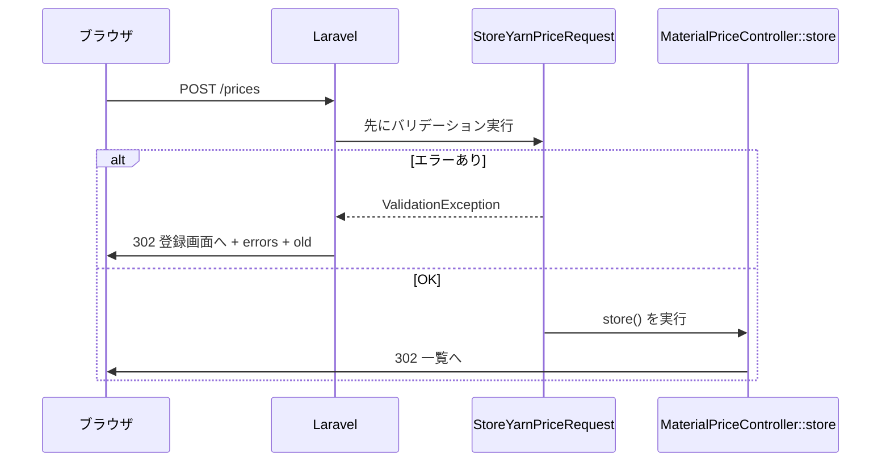

この1行は、**「売上・粗利の詳細」ボタンを押したら、売上一覧ページ（**`/sales`**）へ飛ばすリンク** です。

## 分解して読む

```12:14:resources/views/dashboard.blade.php
        <a href="{{ route('sales.index') }}" class="btn btn-secondary">
            @include('partials.icon', ['name' => 'chart']) 売上・粗利の詳細
        </a>
```


| 部分                          | 意味                                |
| --------------------------- | --------------------------------- |
| `<a href="...">`            | リンク（クリックで別ページへ移動）                 |
| `{{ ... }}`                 | Blade の「ここに PHP の結果を埋め込む」記法       |
| `route('sales.index')`      | 名前付きルート `sales.index` の URL を自動生成 |
| `class="btn btn-secondary"` | ボタン風の見た目用 CSS                     |


ブラウザに渡る HTML はだいたいこうなります。

```html
<a href="http://あなたのサイト/sales" class="btn btn-secondary">…</a>
```


## `route()` は何をしている？

`route('sales.index')` は **「**`sales.index` **という名前のルートの URL を教えて」** という Laravel のヘルパー関数です。

実際のルート定義は **Blade ファイルではなく** `routes/web.php` にあります。

```81:81:routes/web.php
Route::get('/sales', [SalesController::class, 'index'])->name('sales.index');
```

これを日本語にすると：

- **URL** … `/sales` にアクセスしたら
- **処理** … `SalesController` の `index` メソッドを実行
- **名前** … そのルートを `sales.index` と呼ぶ（`->name('sales.index')`）

Blade 側は名前 `sales.index` だけ知っていれば、URL `/sales` を直接書かなくてもリンクが作れます。

## `routes` を使わずにルート定義できる？

**結論：Blade ファイルの中でルート定義はできません。** ルートは必ずどこか（通常は `routes/web.php`）で登録する必要があります。

ただし、`route()` **を使わない書き方** はできます。

### 方法1: URL を直接書く

```blade
<a href="/sales">売上・粗利の詳細</a>
```

動きますが、URL を `/sales-summary` などに変えたとき、`/sales` **と書いた箇所を全部直す**必要があります。

### 方法2: `route()` を使う（このプロジェクトのやり方）

```blade
<a href="{{ route('sales.index') }}">…</a>
```

URL が変わっても `routes/web.php` の1行を直せば、`route('sales.index')` **を使っているリンクは全部自動で追従**します。サイドバーも同じ名前を使っています。

```28:28:resources/views/layouts/app.blade.php
            ['route' => 'sales.index',      'label' => '売上・粗利',   'icon' => 'chart'],
```


## 例えで理解する

- `routes/web.php` … 住所録（「売上一覧 = `/sales`」と登録）
- `route('sales.index')` … 住所録を見て URL を調べる
- **Blade の** `<a href="...">` … その URL への道しるべを貼る

住所録（ルート定義）がないのに `route('sales.index')` だけ書いても、Laravel は「そんな名前のルートはない」とエラーになります。

---

**まとめ：** 12行目は「`sales.index` という名前のページへのリンクを作る」コードです。ルート自体は `routes/web.php` で定義し、Blade では `route()` でその URL を取り出して使う、という役割分担になっています。

# orders画面の流れ


## 結論から

12行目の `route('orders.create')` は、Laravel が `orders.create` **という名前で登録した URL**（`/orders/create`）を自動で作ってくれる書き方です。

「受注を登録」ボタンは **登録フォーム画面** に飛ばしたいので、`orders.create` という名前を使うのが正しい、という意味です。

---


## 3つの仕組みがつながっている


### 1. `web.php` でルートが登録されている

```49:49:routes/web.php
Route::resource('orders', OrderController::class);
```

```
// 一覧
Route::get('/orders', [OrderController::class, 'index'])->name('orders.index');

// 新規作成フォーム
Route::get('/orders/create', [OrderController::class, 'create'])->name('orders.create');

// 新規登録
Route::post('/orders', [OrderController::class, 'store'])->name('orders.store');

// 詳細
Route::get('/orders/{order}', [OrderController::class, 'show'])->name('orders.show');

// 編集フォーム
Route::get('/orders/{order}/edit', [OrderController::class, 'edit'])->name('orders.edit');

// 更新（PUT と PATCH の両方）
Route::put('/orders/{order}', [OrderController::class, 'update'])->name('orders.update');
Route::patch('/orders/{order}', [OrderController::class, 'update'])->name('orders.update');

// 削除
Route::delete('/orders/{order}', [OrderController::class, 'destroy'])->name('orders.destroy');
```

`Route::resource` は、受注管理に必要な URL を **まとめて7本** 作ります。そのとき **それぞれに名前（ルート名）** も自動で付きます。


| ルート名             | URL                 | HTTP      | コントローラー     | 画面の意味      |
| ---------------- | ------------------- | --------- | ----------- | ---------- |
| `orders.index`   | `/orders`           | GET       | `index()`   | 一覧（今いるページ） |
| `orders.create`  | `/orders/create`    | **GET**   | `create()`  | **登録フォーム** |
| `orders.store`   | `/orders`           | POST      | `store()`   | 登録送信       |
| `orders.show`    | `/orders/{id}`      | GET       | `show()`    | 詳細         |
| `orders.edit`    | `/orders/{id}/edit` | GET       | `edit()`    | 編集フォーム     |
| `orders.update`  | `/orders/{id}`      | PUT/PATCH | `update()`  | 更新送信       |
| `orders.destroy` | `/orders/{id}`      | DELETE    | `destroy()` | 削除         |


12行目のボタンは「新規登録フォームを見せて」なので、**GET の** `orders.create` が対応します。

---


### 2. `route('orders.create')` が URL を作る

Blade のこの部分:

```12:14:resources/views/orders/index.blade.php
        <a href="{{ route('orders.create') }}" class="btn btn-primary">
            @include('partials.icon', ['name' => 'plus']) 受注を登録
        </a>
```

`route('名前')` は Laravel の **ヘルパー関数**（便利な組み込み関数）です。

- 入力: ルート名 `'orders.create'`
- 出力: 実際の URL 文字列 `/orders/create`

HTML としてはこうなります:

```html
<a href="/orders/create" class="btn btn-primary">...</a>
```

---


### 3. クリックすると `create()` が動く

`/orders/create` にアクセスすると:

```
GET /orders/create
  → OrderController@create
  → view('orders.create', ...)
  → orders/create.blade.php が表示される
```

つまり「受注を登録」ボタン → 登録フォーム、という流れがコード上も一致しています。

---


## なぜ `/orders/create` と直書きしないのか

次の2つを書いているのは同じ結果になります:

```blade
{{-- 方法A: ルート名を使う（このプロジェクトの書き方） --}}
<a href="{{ route('orders.create') }}">

{{-- 方法B: URLを直書き --}}
<a href="/orders/create">
```

見た目は同じですが、**方法Aの方が安全で保守しやすい**です。

- URL の prefix（先頭）を変えても、`route()` なら自動で追従する
- 「このリンクは登録画面」だと **名前で意図が分かる**
- タイポで存在しないルート名を書くとエラーになり、気づきやすい

---


## 「正しい」とは何が正しいのか

ここでの「正しい」は3点です。

1. **名前が存在する** … `Route::resource('orders', ...)` が `orders.create` を作っている
2. **HTTP メソッドが合う** … リンク（`<a>`）は GET。`orders.create` も GET
3. **画面の目的が合う** … ボタンは「登録フォームへ」。`create()` は登録フォームを返す

逆に、例えば `route('orders.store')` を `<a href>` に使うのは **間違い** です。`store` は POST 専用（フォーム送信）だからです。

---


## 覚え方（例え）

ルート名は **住所の「呼び名」** だと思うと分かりやすいです。


| 呼び名（ルート名）       | 実際の住所（URL）       | 用途       |
| --------------- | ---------------- | -------- |
| `orders.index`  | `/orders`        | 一覧       |
| `orders.create` | `/orders/create` | 新規登録フォーム |
| `orders.show`   | `/orders/5`      | 5番の詳細    |


`route('orders.create')` は「`orders.create` という呼び名の住所を教えて」と Laravel に頼んでいる、というイメージです。

---


## 自分で確認する方法

ターミナルで次を実行すると、名前と URL の対応が一覧できます:

```bash
php artisan route:list --name=orders
```

出力に `orders.create` と `GET|HEAD orders/create` が並んでいれば、12行目のリンクはその定義どおりに動いています。

---

同じページ内では、67行目の `route('orders.show', $o->id)` や111行目の `route('orders.edit', $o->id)` も同じ仕組みです。2番目の引数 `{id}` を渡すと `/orders/5` のように **個別の受注** への URL になります。

## .create画面（登録画面への遷移）

1.index.blade.php

```
<a href="{{ route('orders.create') }}" class="btn btn-primary">
```

↓
2.web.php
でルーティングした

```
Route::resource('orders', OrderController::class);
```

→ルート名orders.createは/orders/createとGETメソッドをサーバに送り、[OrderController::class, 'create']を起動
↓
3.OderContoroller.php

```
public function create(): View
    {
        return view('orders.create', [
            'customers' => DemoData::customers(),
            'products' => DemoData::products(),
        ]);
    }
```

↓
4.orders.create.blade

再掲

```
// 一覧
Route::get('/orders', [OrderController::class, 'index'])->name('orders.index');

// 新規作成フォーム
Route::get('/orders/create', [OrderController::class, 'create'])->name('orders.create');

// 新規登録
Route::post('/orders', [OrderController::class, 'store'])->name('orders.store');

// 詳細
Route::get('/orders/{order}', [OrderController::class, 'show'])->name('orders.show');

// 編集フォーム
Route::get('/orders/{order}/edit', [OrderController::class, 'edit'])->name('orders.edit');

// 更新（PUT と PATCH の両方）
Route::put('/orders/{order}', [OrderController::class, 'update'])->name('orders.update');
Route::patch('/orders/{order}', [OrderController::class, 'update'])->name('orders.update');

// 削除
Route::delete('/orders/{order}', [OrderController::class, 'destroy'])->name('orders.destroy');
```


# 変数マップ

| 変数 | 型イメージ | 作る場所 | 使う場所 |
| orders | Collection | index() | index.blade @foreach |
| search | array | ListSearch::params | list-search partial |
| customers | Collection | create() | create.blade select |

どこかの画面で@extends(layout.app)により、

```
['route' => 'orders.index',     'label' => '受注管理',     'icon' => 'cart'],

<a href="{{ route($item['route']) }}"
                       class="nav-link {{ request()->routeIs(str_replace('.index', '', $item['route']) . '*') ? 'is-active' : '' }}">
                        <span class="nav-link__icon">@include('partials.icon', ['name' => $item['icon']])</span>
                        {{ $item['label'] }}
                    </a>
```

{{ $item['label'] }}=受注管理　を押す
↓
web.php

```
Route::resource('orders', OrderController::class);
(Route::get('/orders', [OrderController::class, 'index'])->name('orders.index');)
```

↓
ordercontoroller

```
 public function index(Request $request): View
    {
        $search = ListSearch::params($request);
        $orders = ListSearch::filter(DemoData::orders(), $search, [
            'status_resolver' => function ($order, $status) {
                if ($status === '出荷残あり') {
                    return $order->shipped < $order->qty;
                }

                return $order->status === $status;
            },
        ])->sortBy([
            ['order_date', 'desc'],
            ['id', 'desc'],
        ])->map(function ($order) {
                $allocation = StockAllocation::statusForOrder($order);
                $order->allocation_status = $allocation['status'];
                $order->allocation_badge = $allocation['badge_class'];
                $order->shippable_status = $allocation['shippable_status'];
                $order->shippable_badge = $allocation['shippable_badge'];
                $order->allocated = $allocation['allocated'];
                $order->stock_allocated = $allocation['stock_allocated'];
                $order->po_allocated = $allocation['po_allocated'];
                $order->remaining = $allocation['remaining'];
                $order->shippable = $allocation['shippable'];
                $order->price = DemoData::findProduct($order->product_id)?->price ?? 0;

                return $order;
            });

        return view('orders.index', [
            'orders' => $orders,
            'search' => $search,
        ]);
    }
```


# 入荷予定日更新のルート


## purchases.index

```
 <th style="min-width:140px;">入荷予定日</th>

 <td>
 @include('partials.purchase-arrival-date-inline-form', [
    'purchase' => $po,
     'search' => $search,
  ])
 </td>
```

## partials.purchase-arrival-date-inline-form

```
 <form method="POST" action="{{ route('purchases.patch-arrival', $purchase->id) }}" 
```

- ちなみに

```
    @csrf
    @method('PATCH')
    @foreach ($search ?? [] as $key => $value)
        @if ($value !== '')
            <input type="hidden" name="{{ $key }}" value="{{ $value }}">
        @endif
    @endforeach
    <input type="hidden" name="arrival_memo" value="{{ $purchase->arrival_memo ?? '' }}">
```

URLのパラメータ部分(/purchases?supplier=東京&status=orderedの?以下)である$searchを$keyに入れ、画面には表示しないinput type="hidden"の形でsupplier=東京&status=orderedという値を一緒にPOSTするときに入れる
こうすることでPOST後もURLにsupplier=東京&status=orderedが残り、返ってくる画面がsupplier=東京&status=orderedに絞ったまんまになる

## web.php

```
Route::patch('/purchases/{purchase}/arrival', [PurchaseOrderController::class, 'patchArrival'])
    ->name('purchases.patch-arrival');
```


## Controllers.purchaseoordercontoroller

```
public function patchArrival(Request $request, int $purchase): RedirectResponse
    {
        $target = $this->findPurchase($purchase);
        $model = PurchaseOrder::query()->findOrFail($purchase);
        $type = $target->type ?? PurchaseOrderType::PRODUCT;

        $validated = $request->validate([
            'expected_arrival_date' => ['nullable', 'date'],
            'arrival_memo' => ['nullable', 'string', 'max:500'],
        ], [], [
            'expected_arrival_date' => '入荷予定日',
            'arrival_memo' => 'メモ',
        ]);

        $date = $validated['expected_arrival_date'] ?? null;
        $model->update([
            'arrival_memo' => (string) ($validated['arrival_memo'] ?? ''),
            'due_date' => $date !== null && $type !== PurchaseOrderType::PRODUCT
                ? $date
                : $model->due_date,
        ]);

        if ($date !== null && $type === PurchaseOrderType::PRODUCT) {
            $model->primaryLine()?->update(['finish_date' => $date]);
        }

        $redirectParams = array_filter(
            $request->only(ListSearch::PARAMS),
            fn ($value) => $value !== null && $value !== ''
        );

        return redirect()->route('purchases.index', $redirectParams)
            ->with('success', "発注 {$target->code} の入荷予定を更新しました。");
    }
```


### $target = $this->findPurchase($purchase);

```
private function findPurchase(int $id): object
    {
        return DemoData::purchaseOrders()->firstWhere('id', $id) ?? abort(404);
    }
```


#### DemoData::purchaseOrders()

```
public static function purchaseOrders(): Collection
    {
        if (self::usesPurchaseOrderDatabase()) {
            return PurchaseOrder::displayList();
        }

        $rows = self::basePurchaseOrderRows()->all();

        foreach (PurchaseOrderOverlay::additions() as $addition) {
            $rows[] = $addition;
        }

        return collect($rows)->map(function ($r) {
            $overrides = PurchaseOrderOverlay::overrides((int) $r['id']);
            if (! empty($overrides)) {
                $r = array_merge($r, $overrides);
            }

            return self::enrichPurchaseOrder($r);
        });
    }
```


##### DemoData.usesPurchaseOrderDatabase()

```
public static function usesPurchaseOrderDatabase(): bool
{
    return self::cachedDatabaseUsage('purchase_orders', fn () => Schema::hasTable('purchase_orders')
        && Schema::hasTable('purchase_order_lines')
        && PurchaseOrder::query()->exists());
}
```

- 何をしているか

purchase_orders テーブルがあるか
purchase_order_lines テーブルがあるか
発注データが1件以上入っているか
この3つを満たすとき「本物のDBを使うモード」と判断します。

例えば
デモ用の固定データではなく、実際にDBに発注を保存している環境では、こちらのルートに入ります。

cachedDatabaseUsage は、同じリクエスト中に何度もDBを調べないための 結果のメモ（キャッシュ） 

##### PurchaseOrder::displayList()

```
public static function displayList(): Collection
{
    return self::query()
        ->with([
            'supplier',
            'shipTo',
            'order.customer',
            'lines.material',
            'lines.greige',
            'lines.product.greige',
        ])
        ->orderByDesc('due_date')
        ->orderByDesc('id')
        ->get()
        ->map(fn (self $po) => $po->toDisplayObject());
}
```

- 何をしているか

DBから発注を取得する（query()->get()）
関連データをまとめて読み込む（with(...)）
仕入先、納品先、受注、明細行など
納期の新しい順に並べる
各行を toDisplayObject() で 画面用オブジェクト に変換する
例えば
DBの生データ（IDだけ、日付だけ）を、そのまま画面に出すのではなく、「仕入先名」「ステータス表示名」などが付いた形に整えて返します。

##### self::basePurchaseOrderRows()

```
public static function basePurchaseOrderRows(): Collection
{
    return collect([
        // --- 製品発注 ---
        [
            'id' => 1, 'code' => 'PO-2606-001', 'type' => PurchaseOrderType::PRODUCT,
            'status' => PurchaseOrderStatus::RECEIVED, 'order_id' => 1,
            'supplier_id' => 6, 'ship_to_id' => 4,
            'product_id' => 1, 'qty_meters' => 200, 'received' => 200,
            ...
        ],
```

- 何をしているか
PHPのコード内に書かれた 固定のデモ用発注データ を返す
製品発注・生機発注・糸発注など、サンプルが複数入っている
まだ「画面用」には整っていない 生の配列（連想配列） の状態
- 例えば
DBがなくてもアプリを動かせるように、最初からサンプル発注が入っているイメージです。

.all() で Laravel の Collection を普通の PHP 配列に変換しています（次の [] で追加しやすくするため）。

##### PurchaseOrderOverlay::additions()（app/Support/PurchaseOrderOverlay.php）

```
/** @return list<array<string, mixed>> */
public static function additions(): array
{
    return session(self::ADDITIONS, []);
}
```

- 何をしているか

ユーザーが画面で 新しく作った発注 を、セッション（ブラウザごとの一時保存）から取り出す
固定デモデータの後ろに、その発注を追加する

- 例えば
デモ中に「新規発注」を作ると、DBには保存されずセッションに溜まります。
additions() はその「後から足された分」を返します。

PurchaseOrderOverlay クラス全体の役割はコメントの通り：

デモ用：発注の追加・更新をセッションに保持する。

# バリデーションエラー時の処理の流れ

結論から言うと、**このプロジェクトのコードのどこかに** `errors` **と** `old` **をセッションに入れる処理を自分で書いているわけではありません**。Laravel が **自動でやってくれる** 仕組みです。

---


## 流れの全体像




**ポイント：** バリデーションに失敗すると、`store()` は **呼ばれません**。

```50:50:app/Http/Controllers/MaterialPriceController.php
    public function store(StoreYarnPriceRequest $request): RedirectResponse
```

`StoreYarnPriceRequest` と書いてある時点で、Laravel は `store()` の前にチェックを走らせます。

---


## このプロジェクトで「定義している」場所


### 1. チェックのルール → `StoreYarnPriceRequest.php`

「何をエラーにするか」はここで決まっています。

```19:29:app/Http/Requests/StoreYarnPriceRequest.php
    public function rules(): array
    {
        return [
            'material_id' => [
                'required',
                'integer',
                Rule::in(DemoData::yarnMaterials()->pluck('id')->all()),
            ],
            'ym' => ['required', 'date_format:Y-m'],
            'price' => ['required', 'integer', 'min:1'],
        ];
    }
```

重複チェックも同じファイルです。

```44:53:app/Http/Requests/StoreYarnPriceRequest.php
    public function withValidator($validator): void
    {
        $validator->after(function ($validator) {
            $materialId = (int) $this->input('material_id');
            $ym = (string) $this->input('ym');

            if ($materialId && $ym && DemoData::hasYarnPrice($materialId, $ym)) {
                $validator->errors()->add('ym', 'この糸・年月の単価はすでに登録されています。');
            }
        });
    }
```


### 2. 画面での表示 → `prices/create.blade.php`

セッションに入った値を **読む側** はここです。


| 書き方            | 役割              |
| -------------- | --------------- |
| `old('ym')`    | 前回入力した値をフォームに戻す |
| `@error('ym')` | エラーメッセージを表示する   |


```25:41:resources/views/prices/create.blade.php
                            <option value="{{ $m->id }}" @selected((string) $m->id === (string) old('material_id'))>
...
                        <input class="input" type="month" id="ym" name="ym" value="{{ old('ym') }}" style="max-width:200px;">
                        @error('ym')<p class="field-error">{{ $message }}</p>@enderror
...
                        <input class="input" type="number" id="price" name="price" min="1" step="1" value="{{ old('price') }}" style="max-width:200px;">
                        @error('price')<p class="field-error">{{ $message }}</p>@enderror
```

---


## 「戻る」「errors」「old」を入れる処理はどこ？

`MaterialPriceController` **にはありません。**  
Laravel 本体（フレームワーク）の `FormRequest` が、バリデーション失敗時にだいたい次のことを自動でします。

1. 直前のページ（登録画面）へリダイレクト（302）
2. セッションに **errors**（エラー内容）を入れる
3. セッションに **old**（入力値のコピー）を入れる

イメージとしては、こんな処理です（実際は Laravel 内部）：

```php
// あなたのプロジェクトにはこのコードはない（Laravel が内部でやる）
throw ValidationException::withMessages($errors);
// → redirect()->back()->withErrors($errors)->withInput();
```

だから仕様書に「セッションに errors と old」と書いたのは、**Laravel の標準の動き**を説明している、という意味です。

---


## 成功時との違い


| 状況         | 誰がリダイレクトするか                                                              | 行き先            |
| ---------- | ------------------------------------------------------------------------ | -------------- |
| 成功         | `MaterialPriceController::store()` の `redirect()->route('prices.index')` | 一覧             |
| バリデーションエラー | Laravel（`FormRequest` の失敗処理）                                             | 登録画面（`back()`） |


成功時の `with('success', ...)` は **自分で書いている** のに対し、  
エラー時の `errors` / `old` は **Laravel が勝手にやる**、という違いです。

---


## まとめ


| 内容                       | 場所                                                               |
| ------------------------ | ---------------------------------------------------------------- |
| 何をチェックするか                | `app/Http/Requests/StoreYarnPriceRequest.php`                    |
| エラー・入力値を画面に出す            | `resources/views/prices/create.blade.php` の `old()` / `@error()` |
| 戻る・errors・old をセッションに入れる | **Laravel 標準**（プロジェクト内に明示コードなし）                                  |


「どこに書いてあるの？」と探すなら、`StoreYarnPriceRequest` と `create.blade.php` の2か所が該当で、**リダイレクト自体はフレームワーク任せ**、と覚えると整理しやすいです。